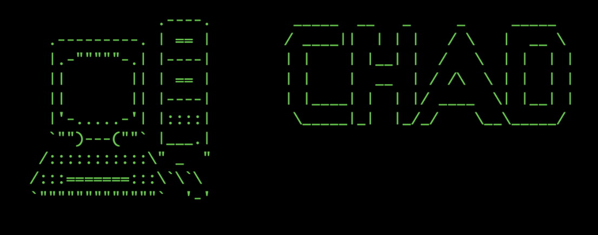

# terminal-site
Website that looks and acts as a terminal. Runs on http.server through python and was coded in html, css, and js. 

Retro‑style browser terminal built with Django.

## Quick start

1. Clone the repo and enter the folder  
   `git clone https://github.com/your‑username/terminal-site.git && cd terminal-site`
2. Create a virtual environment  
   `python -m venv .venv && source .venv/bin/activate`
3. Install dependencies  
   `pip install -r requirements.txt`
4. Run migrations  
   `python manage.py migrate`
5. Launch the development server  
   `python manage.py runserver`

Open <http://127.0.0.1:8000> in your browser.

## Usage

When the terminal appears, type `help` and press **Enter** to list the available commands.

## Tech stack

- Django 5
- HTML + CSS + vanilla JS

## License

MIT

Diagrams:

